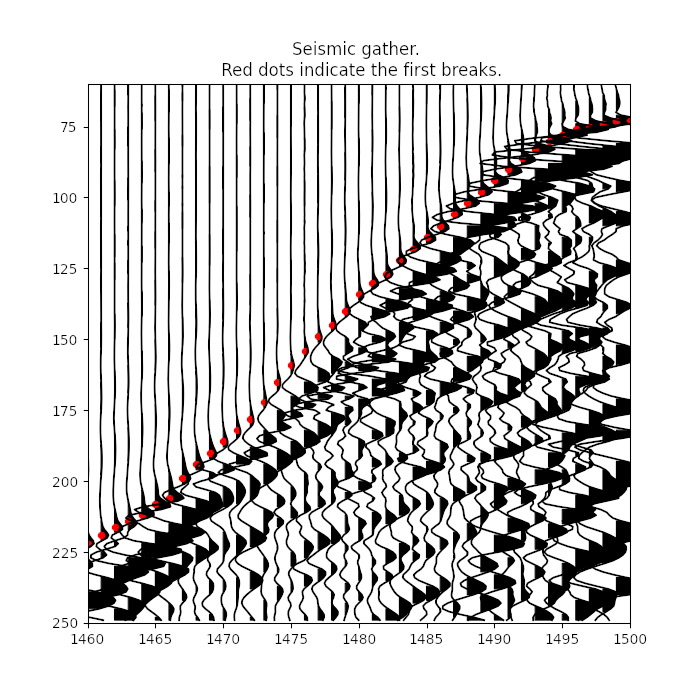

#  First break picking

The objective of First Break Picking is to determine the arrival time of the wave traveling from source to receiver for each seismic trace.

A number of approaches were applied to this task, the most common ones are based on the concepts of energy in moving windows, cross-correlations, or calculation of higher-order statistics of the trace. Recently a new class of neural network-based solutions for FBP has emerged, led by rapid advances in deep learning and corresponding hardware.

## Data:

* Train set

	- train.sgy
	- train.csv

	It consists of SEG-Y file `train.sgy` with trace data and csv file `train.csv` with three columns that correspond to FieldRecord id, TraceNumber id and value of first break time (see example below)

* Test set

	- test.sgy

	It consists of SEG-Y file `test.sgy` with data from another survey. Participants should produce first breaks for this data, format them according to the example and submit them for [evaluation](http://hackathon.eage-annual-amsterdam.org:8080).

* Examples
	- [SEG-Y file with trace data](./data/example_prestack.sgy)
	- [csv file with first break times](./data/example_picking.csv)

## Submission process:

To submit results one should generate a csv file with three columns: the first one corresponding to FieldRecord id in test.sgy, second - to TraceNumber ids, and the last one should contain predicted first break times for corresponding trace. See a [sample submission file](./data/sample_submission.csv).

When the file is created and properly formatted, one should go to a [scorer site](http://hackathon.eage-annual-amsterdam.org:8080), select `FBP` task,  upload the file in the form and click `Submit` button.

## Metric:

The metric used to calculate the difference between participants' submits and ground truth label is MAE:

,

where fbpi is measured in milliseconds and N is the total numer of traces in Test SEG-Y file.
